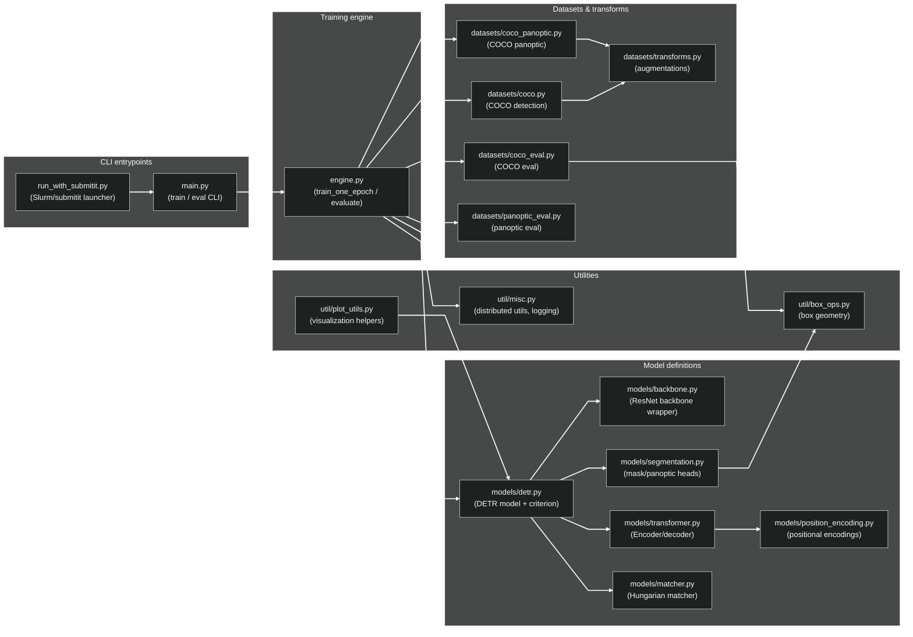

# DETR Training Container — Components

This page documents the main components of the DETR training codebase and how they interact.

At a high level, the training flow is:

> Dark-theme note: the Mermaid init block above forces **arrow/link stroke color to white** and uses light text colors so edges and labels remain readable.

## Notes

- If your docs renderer applies additional CSS to Mermaid SVGs, this diagram still forces edge strokes via `linkStyle default`.
- If you add more edges and want per-edge overrides, you can append additional `linkStyle <index> ...` lines.
